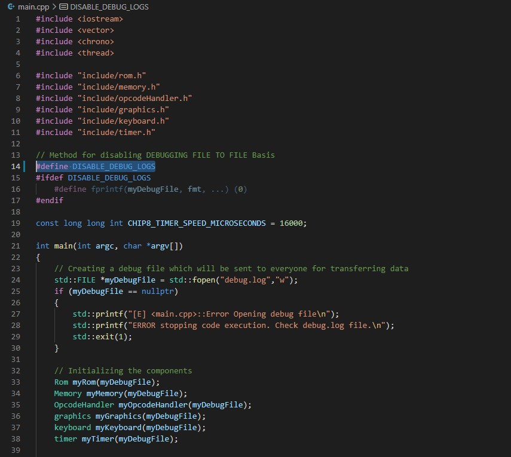

# CHIP-8 Emulator

## Introduction
CHIP-8 is a 8-bit microprocessor released in mid-1970. This repo includes c++ code to emulate CHIP-8. It can be used to run chip-8 programs like pong, space invaders, etc. Following gif shows the chip-8 emulator in action.

Wikipedia link: https://en.wikipedia.org/wiki/CHIP-8 

## How to Build and Run the emulator
This section will cover details regarding how to configure this chip-8 and build the project yourself. For this project I have used vscode (with MSVC compiler) so I will be covering only details regarding the same. If you are using any other IDE/compiler, I don't think it would we hard to build the project. All you need to do is to compile all .cpp files and at linker step you need to additionally link the SDL2.lib which can be found in the same folder.

### Prerequistes
You will need to install following tools if you planning to build this project using vscode and MSVC compiler:
1. Install vscode: https://code.visualstudio.com/ 
2. For vscode install C/C++ Extension: https://marketplace.visualstudio.com/items?itemName=ms-vscode.cpptools
3. Configure MSVC for vscode (including installation): https://code.visualstudio.com/docs/cpp/config-msvc - Refer to Prerequisites section here to install MSVC compiler. Also if you have time you can complete the whole configuration, it will give you an idea of how to build using MSVC and vscode using "hello world" program.

### Build the code
Once you have installed MSVC and vscode, the rest of the building should be easy. In the .vscode folder I have already defined all necessary .json (there are 4 of them) files for building the project. The only place you may need to edit is in *c_cpp_properties.json*. Here you might need to change the *compilerPath* option to your own compiler location.

To build the project, in vscode goto *Terminal->Run Build Task*. And to launch the emulator goto *Run->Start Debugging*. This will launch the chip8.exe which was build earlier.

#### Additional Debugging messages
In this project the debugging messages are collected in *debug.log* file which will be generated after you launch chip8.exe. If you are going to run the emulator for a long time (more than 15 mins) it might be sensible to disable the debugging messages as you may get a large *debug.log* generated.

To ease up the work of disabling logging, in the project all you need to uncomment a line in each .cpp (i.e. you will need to uncomment a total of 7 lines - one for each .cpp file - main.cpp, graphics.cpp, keyboard.cpp, memory.cpp, opcodeHandler.cpp, rom.cpp & timer.cpp). See the images below for example:

Note that you can enable or disable debugging at each .cpp file level also. You can disable logging for graphics.cpp and keyboard.cpp while getting messages for rest of the files. This is done to have finer control over debugging messages for easy troubleshooting any issues.

### Load different ROMs
As you can see in the GIF in Introduction section, whenever the emulator start it will ask you to give you the relative address (from current working directory) to the ROM. I would recommend you create a folder named *ROM* under you current directory and put all the ROMs you may want to load there.

## Acknowledgement
There are many resources available online which you can use for building your own CHIP-8 emulator. Here are the few which I have used:
- [Cowgod's Chip-8 Technical Reference](http://devernay.free.fr/hacks/chip8/C8TECH10.HTM)
- [Chip-8 Emulator Wikipedia Page](https://en.wikipedia.org/wiki/CHIP-8#)
- [Laurence Muller Article: How to Write Chip-8 Emulator](http://www.multigesture.net/articles/how-to-write-an-emulator-chip-8-interpreter/)
- [Austin Morlan: Building a Chip-8 Emulator](https://austinmorlan.com/posts/chip8_emulator/)
- [Lazy Foo' SDL Tutorial](https://lazyfoo.net/tutorials/SDL/index.php)
- [SDL APIs](https://wiki.libsdl.org/APIByCategory)
- [Chip-8 ROMs](https://github.com/kripod/chip8-roms)

Happy Emulating :smile:!!
